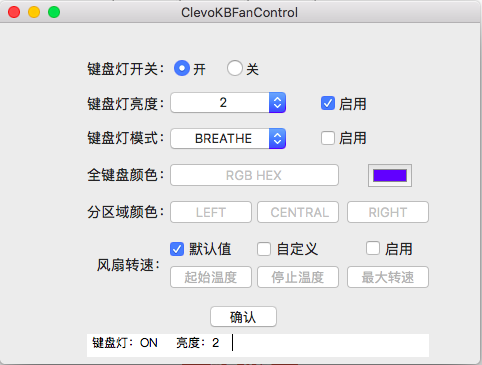

# Clevo中蓝天模具键盘灯及风扇控制软件
* 如何安装

```
1. 首先搜索DSDT，确保有WMBB方法。
2. 将我提供的SSDT-SMCD.aml放在CLOVER/ACPI/patched文件夹下。
3. 将我提供的ClevoControl.kext安装在/Library/Extensions，请不要装在/System/Library/Extensions中，不然可能会出现内核崩溃。
4. 重启后，安装我提供的GUI控制软件就可以控制键盘灯的亮度和颜色以及风扇速度。
```
* 软件使用介绍


```
1. 键盘灯开关控制键盘灯。
2. 键盘灯亮度有4个亮度级别，需要勾选启用才会生效。
3. 键盘灯模式有8个模式，默认为呼吸灯，需要勾选启用才会生效。
4. 全键盘颜色用来设置整个键盘的颜色，点选右侧颜色条选择颜色。
5. 分区域颜色用来设置分块键盘的颜色，点选颜色条选择颜色。
6. 风扇转速用来控制设备风扇，有默认值和自定义两个选项，自定义需要设置起始温度，停止温度，以及最大转速，最大转速为百分比，需要勾选启用才会生效。
```
目前软件暂不支持重启后保存设置，后续会添加。
* 支持的设备

|产品名|模具型号|
|---|---|
|P15SM|Clevo P15SM|
|P15SM1-A|Clevo P15SM1-A|
|P15SM-A|Clevo P15SM-A|
|P150EM|Clevo P150EM|
|P15xEMx|Clevo P150EM|
|P17SM-A|Clevo P17SM-A|
|P17SM|Clevo P17SM|
|P370SM-A|Clevo P370SM-A|
|P65_67RSRP|Clevo P65_67RSRP|
|P65xRP|Clevo P65xRP|
|P65xHP|Clevo P65xHP|
|Deimos/Phobos 1x15S|Clevo P7xxDM(-G)|
|P7xxDM(-G)|Clevo P7xxDM(-G)|
|P7xxDM2(-G)|Clevo P7xxDM2(-G)|
|P750ZM|Clevo P750ZM|
|P5 Pro SE|Clevo P750ZM|
|P5 Pro|Clevo P750ZM|
|P775DM3(-G)|Clevo P775DM3(-G)|
|N85_N87|Clevo N850HJ|
|P870DM|Clevo P870DM|
|N85_N87,HJ,HJ1,HK1|Clevo N870HK|
|N85_87HP6|Clevo N870HP6|
|P95_HP,HR,HQ|Clevo P950HP6|
|P65_67HSHP|Clevo P65_67HSHP|

* 感谢
Clevo控制部分源代码参考[clevo-xsm-wmi](https://bitbucket.org/tuxedocomputers/clevo-xsm-wmi)以及[ClevoControl](https://github.com/datasone/ClevoControl)
